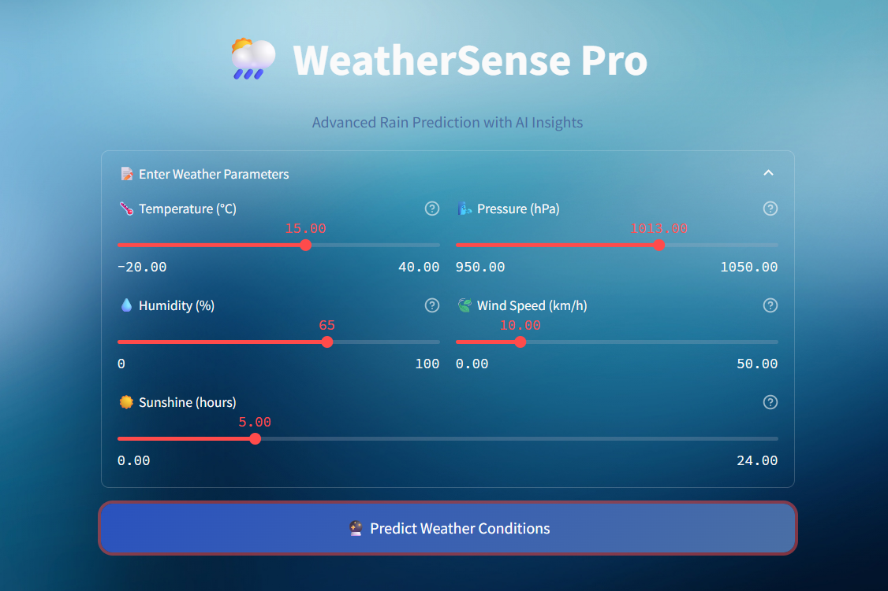
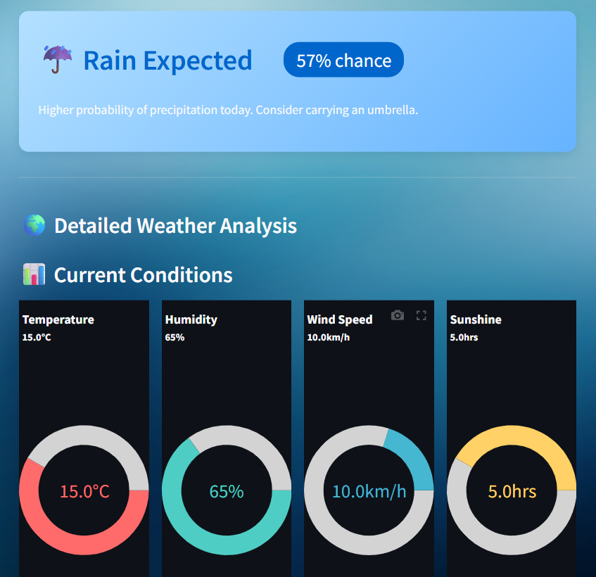
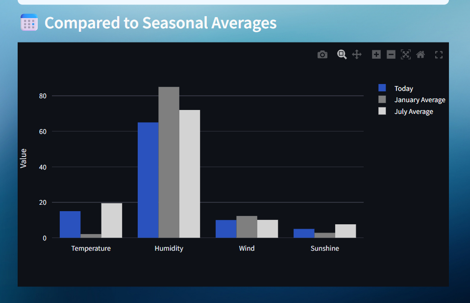

# 🌦️ Rain Prediction using Machine Learning

A machine learning-based application that predicts the likelihood of rain using real-time weather data. This project uses historical weather records to train a model and delivers an interactive prediction interface via a modern web app built with **Streamlit**.

## 🧠 Technologies Used

- **Python**
- **Pandas, NumPy** – data handling
- **Scikit-learn** – ML model and preprocessing
- **Random Forest Classifier**
- **Streamlit** – for building the web interface
- **Plotly** – data visualizations
- **Pickle** – model serialization

## 📈 Features

- Predicts the chance of rain based on:
  - Temperature
  - Humidity
  - Pressure
  - Wind Speed
  - Sunshine hours
- Interactive sliders for input
- Visual gauge meters and bar charts
- Personalized tips for rain or sunshine
- Historical comparison with seasonal data
- UV index estimation for sunny days

## 🔧 How It Works

1. **Model Training** (`model_training.py`):
   - Loads historical weather data.
   - Extracts features and labels (`RainToday`).
   - Trains a Random Forest Classifier.
   - Saves the model and scaler as `.pkl` files.

2. **Web App** (`app.py`):
   - Loads the trained model and scaler.
   - Accepts user inputs via Streamlit sliders.
   - Predicts rainfall probability.
   - Displays detailed visuals and suggestions.

## 🚀 Running the Application

1. **Install Requirements**:

   ```bash
   pip install streamlit pandas numpy scikit-learn plotly pillow
   ```

2. **Run the App**:

   ```bash
   streamlit run app.py
   ```

3. **Train the Model** (if not already trained):

   ```bash
   python model_training.py
   ```

4. Make sure the following files are in the same directory:
   - `app.py`
   - `model_training.py`
   - `rain_prediction_model.pkl`
   - `scaler.pkl`

## 📂 Project Structure

```
rain-prediction/
├── app.py
├── model_training.py
├── rain_prediction_model.pkl
├── scaler.pkl
├── weather_prediction_dataset.csv
└── README.md
```

## 📸 Screenshots (optional)





